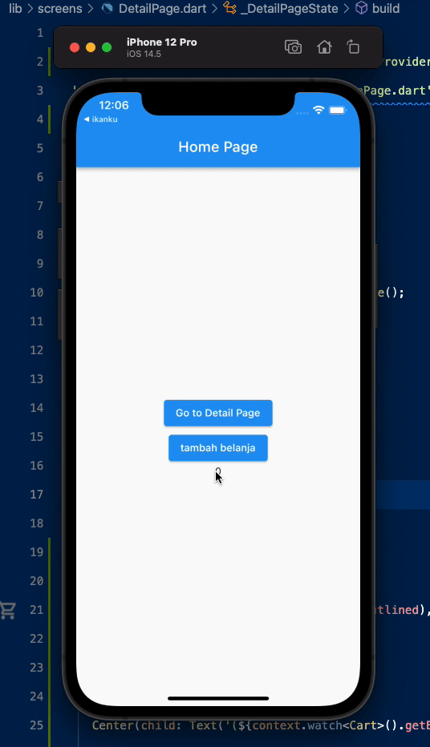

# pemrograman_komputer

implenetasi provider

## referensi
- Fundamental Parsing JSON in Flutter: https://medium.com/nusanet/fundamental-parsing-json-in-flutter-4c7ffc58fb6f
- Flutter CRUD API (Part 1): https://medium.com/nusanet/flutter-crud-api-part-1-c8e252c5464d

## contoh implementasi provider

